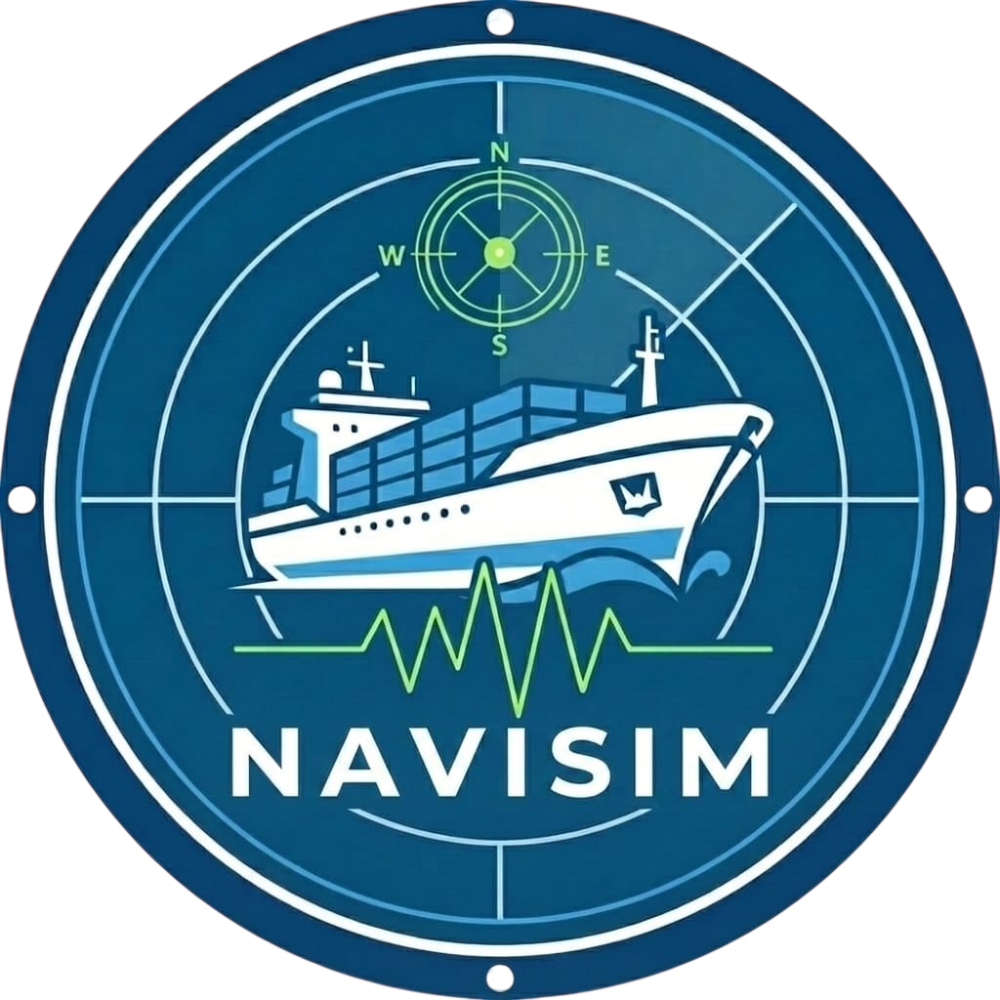
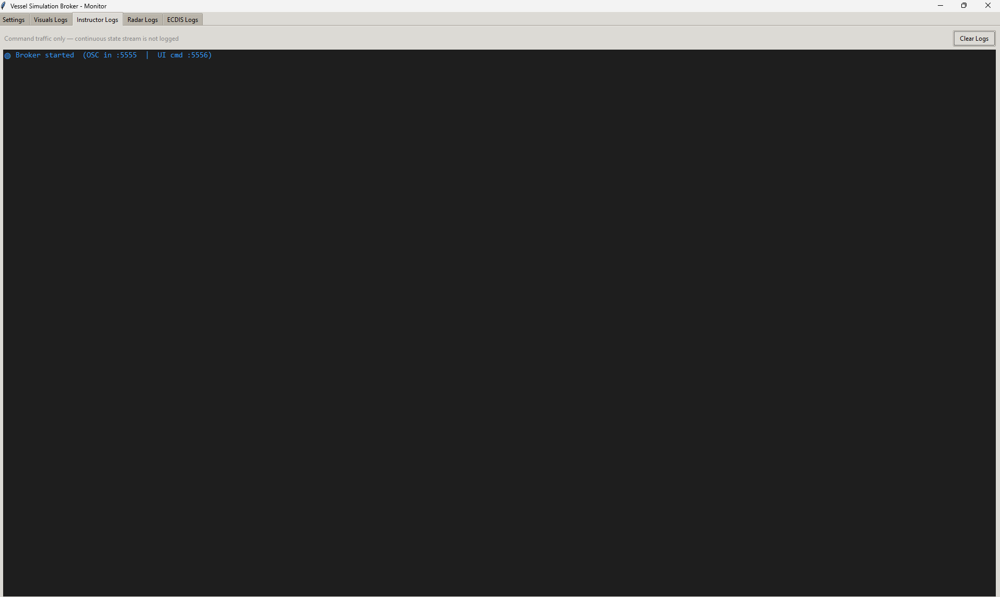
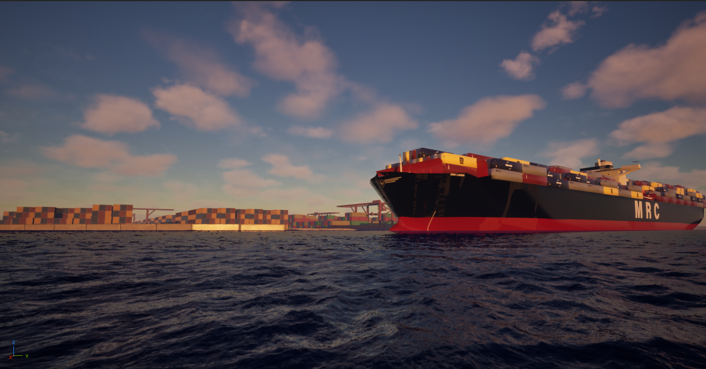
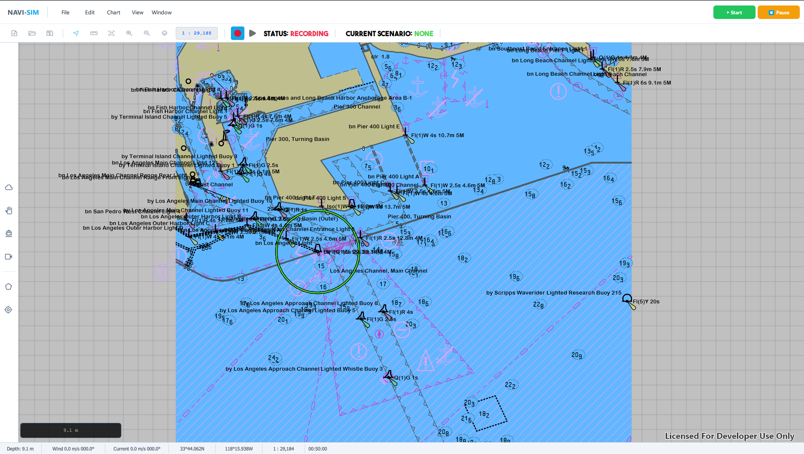
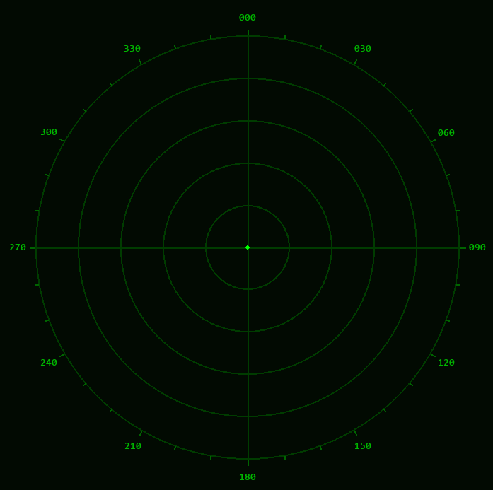

# Maritime Ship Simulation
A comprehensive, multi-module maritime ship simulation system developed as a graduation project. This simulator features realistic hydrodynamics, a full-featured instructor control station, topological radar tracking, and high-fidelity visual environments.

# System Architecture & Modules
This project is divided into four primary modules that operate concurrently. The system utilizes a central Message Broker to route telemetry and state data across the network, facilitating communication between the user interfaces and the Unreal Engine physics/visual environment.
## 1. Message Broker (Python)
The central hub of the simulation that bridges the different technologies. It operates via a Tkinter tabbed dashboard. The broker handles:
* **Protocol Translation:** Receives UDP/JSON payloads from the Instructor station and translates them into OSC (Open Sound Control) messages for Unreal Engine.
* **Physics State Calculation:** Utilizes `pymaneuvering` to calculate the vessel's live physics state (surge, sway, yaw rate) based on incoming inputs.
* **Data Forwarding:** Converts Unreal OSC data (such as contact blips and land coordinate sweeps) into JSON to be forwarded over raw UDP to the Radar module.

## 2. Visuals (Unreal Engine)
The 3D environment
* **Waterline PRO 6 Integration:** Handles all high-fidelity water systems, buoyancy, and hydrodynamic physics.
* **Weather & Telemetry Control:** Unreal Engine is controlled externally via OSC messages for vessel state and HTTP PUT requests via the Unreal Remote Control API for dynamic weather adjustments (wind, wave height, foam, and chop).

## 3. Instructor Station (Qt)
The primary command dashboard for controlling the simulation environment.
* Developed in C++ using the Qt framework.
* Incorporates the ArcGIS Maps SDK for Qt for mapping and navigation overlays.
* Communicates with the broader system by sending standard UDP/JSON packets to the Message Broker.

## 4. Radar (Python/Pygame)
A live topological radar and compass HUD.
* Built using `pygame`
* Listens on a dedicated UDP port for live coordinate sweeps (`/radar/land`) and ship telemetry (`/radar/blip`) from the broker to render dynamic landmasses and targets in real-time.

# Requirements & Dependencies
### Qt (Instructor Module)
| Requirement | Version | Notes |
| :--- | :--- | :--- |
| Qt | 6.8.2+ | Must be exactly 6.8.2 or higher |
| [ArcGIS Maps SDK for Qt](https://developers.arcgis.com/qt/downloads/) | 200.8.1 | Must match exactly |
| CMake | 3.16+ | Bundled with Qt Creator |
| Compiler | MSVC 2022 64-bit | Windows compiler |
| Python | 3.8+ | For the physics engine |
### Required Qt Modules:
* `Qt Core`, `Qt Quick`, `Qt QML`, `Qt Multimedia`, `Qt Positioning`, `Qt Sensors`, `Qt WebSockets`, `Qt Network`
* `Qt WebView` *(Required for ArcGIS toolkit)*
* `Qt WebChannel` *(Dependency of WebView)*
* `Qt WebEngine` *(Dependency of WebView)*
### Unreal Engine (Visuals Module)
* **Waterline PRO 6** plugin installed and enabled in the Unreal Engine project. (Note: As this is a paid asset, the plugin binaries are not included in this repository).
### Python (Broker)
```bash
pip install pymaneuvering
pip install python-osc
```
### Python (Radar)
```bash
pip install pygame
pip install requests
```
# Credits & Acknowledgments
This project was made possible through the integration of several powerful frameworks, SDKs, and assets.
### Core Technologies & SDKs:  
* [**Qt Framework:**](https://www.qt.io/) Used for the development of the instructor station user interface.
* [**ArcGIS Maps SDK for Qt:**](https://developers.arcgis.com/qt/get-started/) Provided the mapping toolkit and navigation overlays for the instructor dashboard.
* [**Unreal Engine 5**:](https://www.unrealengine.com/) Powered the 3D visual environment and high-fidelity rendering.
### Physics & Simulation:
* [**pymaneuvering**:](https://github.com/nikpau/pymaneuvering) Utilized within the Python Message Broker to calculate the core hydrodynamic state and vessel physics (surge, sway, yaw rate).
### Visual Assets & Plugins:
* [**Waterline PRO 6:**:](https://www.fab.com/listings/0c1fc983-db84-4df3-b623-03db76d552c6?lang=en) This project relies on the Waterline PRO 6 plugin for Unreal Engine to drive buoyancy, water visuals, and weather-impacted hydrodynamics. (Note: Asset files are omitted from this repository per licensing agreements).
